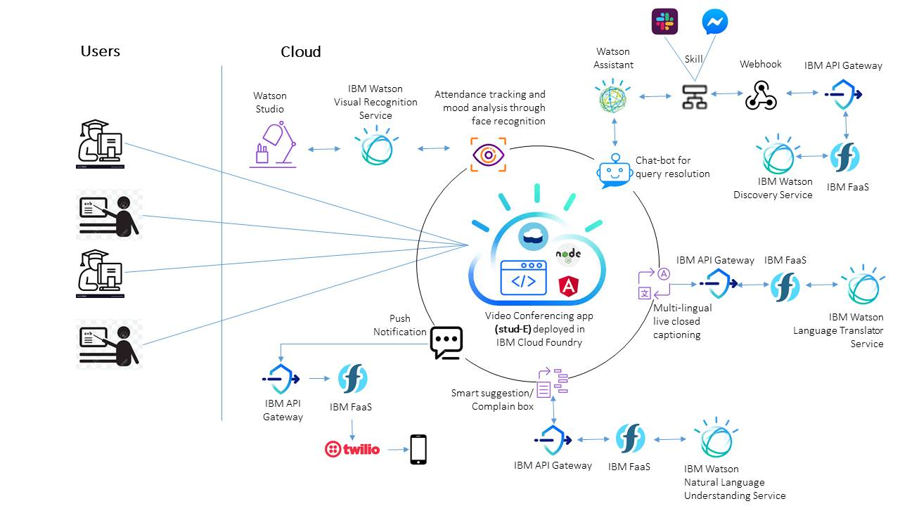

# CFC2020_stud-E
 Remote education platform for CFC202. developed by team Ethical Hackers. Solution name is <b>stud-E</b>.

# Submission Track-
Theme: COVID-19
Remote Education: Implementation of an online educational environment and creation of useful tools to assist teachers and students.

# Problem Statement-
Part of the World Health Organization’s guidance on limiting further spread of COVID-19 is to practice social distancing. As a result, schools in most affected areas are taking precautionary measures by closing their facilities. Schools and teachers can continue to engage with their students through virtual classrooms, and even create interactive spaces for classes. As parents face a new situation where they may need to home-school their children, finding appropriate online resources is important as well.

# Short Description-
Development of a Remote Education System, powered by Artificial Intelligence and Machine Learning, leveraging IBM Cloud.

# Long Description-
Transition to online remote education system, from traditional classroom based environment, is a paradigm shift. Several features, which were easily accessible in traditional classroom based systems, would now be difficult to achieve in an online remote education platform. We can leverage Artificial Intelligence and Machine Learning backed tools to improvise the utilities of online remote education. Broadly, the idea is to create an online video conferencing platform and provide below facilities. These are special non-trivial features. Typical trivial features of an online remote education platform are not mentioned here.

<b>1.	Attendance tracking through visual recognition of students:</b> No need for formal roll call. The tool should be smart enough to automatically detect students based on visual recognition service of Watson. There will be option to attend the class a ‘Guest’ as well.

<b>2.	Smart Chat-bot for Quick Query Clearance of Students:</b> They do not need to interrupt and ask the teacher frequently on common questions. The chat bot, developed on Watson Assistant and Discovery, will help students to quick clarify their doubts; while teacher can continue his/her lecture uninterruptedly. Few students feel shy to ask questions in front of others. This chat bot will help them as well. Upload the PDF copy of the book in discovery. The bot is integrated with Slack and Facebook messenger as well; so allowing students to access this tool even from outside stud-E application.

<b>3.	Mood analysis through visual recognition of students:</b> <I>How is everyone doing so far? Am I being clear? Anyone confused?</I> Professors might ask these questions midway through a lecture to get a sense of students’ moods. The scattered answers often are not very helpful, if they are even accurate. With sentiment analysis software, instructors do not need to ask. Instead, they can glance at their computer screen at a particular point or stretch of time in the session and observe an aggregate of the emotions students are displaying on their faces: happiness, anger, contempt, disgust, fear, neutrality, sadness and surprise.

<b>4.	Multilingual Live closed caption:</b> In case of problem in understanding teacher's (or student's) voice, the live closed caption will help. This tool will also translate the speech in students’ preferred language, at run time, through Watson language translator service. Language should not be any barrier to learning.

<b>5.	Smart Suggestion / Complain Box:</b> Allow students (and parents) to submit anonymous suggestions or complaints in free float text. Use Watson natural language processing service to analyse those contents and help the school authority to gauge the overall pulse, and take corrective actions and preventive measures.

<b>6.	Attention seeking using Quick Quiz:</b> At pre-defined intervals of time, a configurable set of question will pop up the screen and student will need to answer the same within 1 minute; otherwise, unanswered questions will disappear. This feature is specially developed to make sure student is paying proper attention to the lecture provided by the teacher.

<b>7.	Send SMS as reminder or information broadcast:</b> So that students they do not miss the lectures (or to broadcast some messages). Twilio platform is leveraged to achieve this push notification. We avoided WhatsApp to reduce dependencies on internet. 

# List of IBM Cloud Services used in the Solution-
The solution is completely developed based on IBM Cloud. Below services are being used.
-	IBM Cloud Foundry for deployment
-	IBM Cloudant NoSql database for storing JSON objects used in Analytics
-	IBM Watson Natural language understanding service used in Suggestion/Complain box
-	IBM Watson Language Translator Service
-	IBM Watson Discovery Service
-	IBM Watson Assistant
-	IBM Watson Visual Recognition Service
-	IBM Watson Studio
-	IBM API Gateway and FaaS (function as a service)

# Overall Solution Architecture-
</img>

# Solution URL-
https://chattalk-client.eu-gb.cf.appdomain.cloud/

# Link to publicly accessible GitHub repository-
https://github.com/chsubhasis/CFC2020_stud-E.git

# Link to a demo video-
< TODO >

# Solution Roadmap-
Refer to the solution architecture diagram to gauge the landscape of the current application. As part of this prototype development, below features are NOT implemented in this minimum viable product (MVP), and here is a plan to implement these feature. We assume a dedicated team of 4 (1 Team lead + 3 developers + 1 Tester) will be focussing on this to meet the timeline.

<table border="1">
    <tr>
        <td><b>Action Item</b></td>
        <td><b>Expected Timeline</b></td>
    </tr>
    <tr>
        <td>Upgrade the IBM Cloud account from Lite to Standard</td>
        <td>August 2020</td>
    </tr>
    <tr>
        <td>Upgrade the Twilio account to a licensed version. Currently we are using free version that supports only 1 phone number</td>
        <td>August 2020</td>
    </tr>
    <tr>
        <td>User role Authorization</td>
        <td>September 2020</td>
    </tr>
    <tr>
        <td>Security Implementation</td>
        <td>October 2020</td>
    </tr>
    <tr>
        <td>Join the virtual classroom on call; in case of unavailability of Internet</td>
        <td>October 2020</td>
    </tr>
    <tr>
        <td>Train the Visual Recognition service with pictures of students</td>
        <td>September 2020</td>
    </tr>
    <tr>
        <td>Train the Discovery Service with text book pdfs / images</td>
        <td>September 2020</td>
    </tr>
    <tr>
        <td>Integration Testing and Deployment</td>
        <td>December 2020</td>
    </tr>
</table>

# Email Addresses-
- Subhasis Chakraborty – Subhasis.Chakraborty@Cognizant.com (Team Leader)
- Sankha Biswas – Sankha.Biswas@cognizant.com 
- Arijita Dey – Arijita.Dey@cognizant.com 
- Sourav Mondal – Sourav.Mondal9@cognizant.com 
- Sanghamitra Basu – Sanghamitra.Basu@cognizant.com 
